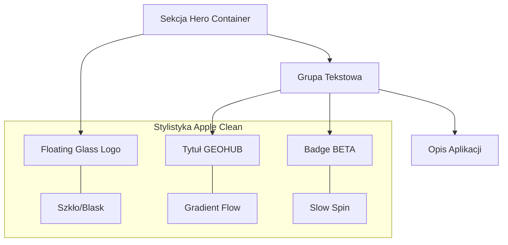

# Plan Redesignu sekcji Hero - "Floating Hub" (Apple Clean)

Ten dokument opisuje kroki niezbędne do wdrożenia nowej koncepcji wizualnej sekcji Hero na stronie głównej GeoHub.

## 1. Zmiany w CSS (`css/styles.css`)

Dodamy nowe animacje i klasy narzędziowe na końcu pliku, aby wspierać efekt "pływania" i dynamicznych gradientów.

### Animacje i Klasy
- **Gradient Flow**: Płynne przesuwanie tła gradientowego.
- **Floating Element**: Delikatna lewitacja (pionowa).
- **Slow Spin**: Bardzo wolny obrót (dla ikony Beta).
- **Text Breathing**: Efekt "oddychania" tekstu (zmiana `letter-spacing`) przy najechaniu myszą.

**Zasada:** Całkowity zakaz używania `@apply`.

## 2. Zmiany w JS (`js/views.js`)

Zostanie przebudowana metoda `htmlHome()` w obiekcie `appViews`.

### Nowa Struktura Hero
- **Kontener**: Elastyczny układ `flex`, który centruje elementy w kolumnie na mobile i ustawia je w rzędzie na desktopie.
- **Szklany Logotyp**: Nowy element `div` z efektem szkła (`backdrop-blur`), lewitujący nad tłem. Zawiera ikonę `globe-2`.
- **Typografia GEOHUB**: Tekst z gradientem animowanym przez `animate-gradient-flow` oraz interaktywnym efektem `hover-breathing`.
- **Badge BETA**: Zastąpienie starego "ALPHA PRO" nowym, minimalistycznym badgem "BETA" z obracającym się emoji satelity.
- **Opis**: Przeniesiony pod tytuł z dodanym opóźnieniem wejścia (`delay-200`), aby stworzyć sekwencyjną animację pojawiania się.

## Schemat Blokowy (Mermaid)

## Kroki wdrożenia
1. Aktualizacja stylów w `css/styles.css`.
2. Podmiana szablonu HTML w `js/views.js` (metoda `htmlHome`).
3. Weryfikacja responsywności i poprawności ładowania ikon Lucide.

Czy akceptujesz ten plan? Jeśli tak, przejdziemy do trybu Code, aby go zaimplementować.
