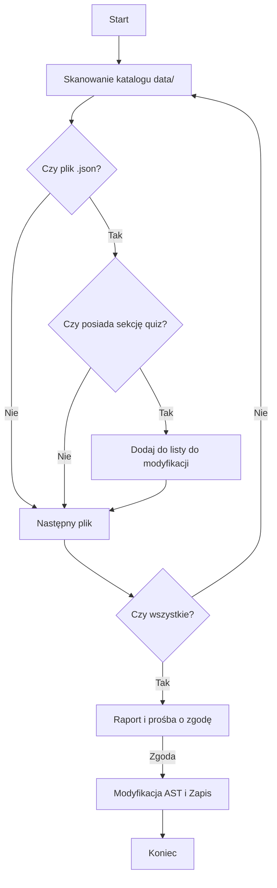

# Plan ujednolicenia formatu odpowiedzi w quizach

## Cel
Usunięcie przedrostków typu "A. ", "B. ", "C) " z tekstów odpowiedzi w plikach JSON, przy zachowaniu nienaruszonych kluczy `answer`.

## Architektura rozwiązania
Zastosujemy podejście oparte na AST (Abstract Syntax Tree) poprzez `JSON.parse()` i `JSON.stringify()`, aby zapewnić integralność struktury danych.

### Faza 1: Skanowanie (Analiza)
1. Rekursywne przeszukanie katalogu `data/`.
2. Identyfikacja plików `.json`.
3. Weryfikacja obecności sekcji `quiz` w `lessonData` lub `testData`.
4. Raport liczbowy dla użytkownika.

### Faza 2: Modyfikacja (Implementacja)
1. Wczytanie pliku.
2. Parsowanie do obiektu JavaScript.
3. Iteracja po pytaniach w tablicy `quiz`.
4. Transformacja tablicy `options` za pomocą Regex: `opt.replace(/^[A-D][\.\)]\s+/, '').trim()`.
5. Zapisanie zmodyfikowanego obiektu do pliku z zachowaniem formatowania (2 spacje).

## Schemat blokowy procesu

## Kroki do wykonania (TODO)
1. Przeskanowanie katalogu `data/` w celu zidentyfikowania wszystkich plików `.json` zawierających sekcję `quiz`.
2. Przygotowanie skryptu, który policzy pliki i zweryfikuje strukturę.
3. Przedstawienie raportu: "Przeskanowano [X] plików. Gotowych do bezpiecznej modyfikacji jest [Y] plików".
4. Uzyskanie zgody na wykonanie zmian.
5. Wykonanie modyfikacji w trybie `code`.
6. Weryfikacja poprawności danych.
